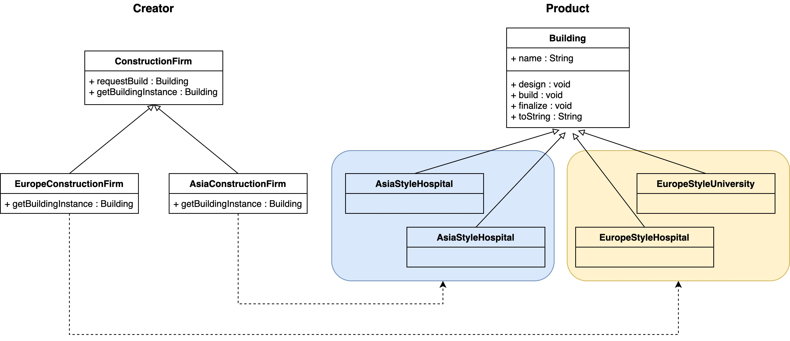

# [디자인 패턴] 팩토리 패턴 (1) - 팩토리 메소드 패턴 (Factory Method Pattern)

팩토리 패턴은 객체 생성을 서브 클래스에서 결정하는 `팩토리 메소드 패턴`과 서로 연관된 객체들의 제품군을 생성할 때 유용한 `추상 팩토리 패턴`, 두 가지 방식이 있다.
<br />
이번 포스팅에서는 팩토리 메소드 패턴에 대해 알아보고, 다음 포스팅에서 추상 팩토리 패턴에 대해 정리해보자.


## 1. 팩토리 메소드 패턴 정의

<div align="center">
  
</div>

객체 생성을 처리하는 모듈을 `팩토리`라 하고, 객체 생성을 캡슐화 하는 것을 팩토리 패턴이라 한다.

`팩토리 메소드 패턴은 어떤 객체의 인스턴스를 생성할지를 서브 클래스에서 결정하는 디자인 패턴`이다. 객체 생성을 처리하는 팩토리를 외부에 두지 않고, 서브 클래스에 둠으로써 객체 생성부를 캡슐화 한다. 수퍼 클래스와 서브 클래스의 팩토리가 서로 연관 관계를 갖되 코드 상으로는 완전히 분리시킬 수 있다.


## 2. 팩토리 메소드 패턴 설계하기

팩토리 메소드 패턴을 직접 설계해보자. 세 단계에 걸쳐서 팩토리 메소드 패턴을 적용하려고 한다.

```
1 단계 - 객체 생성부 미분리
2 단계 - 객체 생성을 외부 팩토리에서 처리
3 단계 - 서브 클래스에서 객체 생성 결정
```

**예제**
<br />
클라이언트가 원하는 형식의 건물을 지어야 한다. 유럽 건설사, 아시아 건설사 두 개의 건설사가 있으며, 건설사마다 건물(병원, 대학)을 짓는 방법이 다르다.
클라이언트가 특정 건설사에게 건물의 건축을 요청하였다. 요청에 따라 건설사가 어떻게 건물을 짓는지 설계해보자.


### [1 단계] 객체 생성부 미분리

클라이언트의 요청을 처리하는 메소드에서 객체 생성 역할까지 담당한다.

```java
public class EuropeConstructionFirm extends ConstructionFirm {
  // 건물 건설 메소드 (클라이언트에서 호출하는 메소드)
  @Override
  public Building requestBuild(BuildingType type) {
    Building building = null; 

    // 객체 생성부
    // 변경 일어나는 부분
    switch (type) {
      case HOSPITAL:
        building = new EuropeStyleHospital();
        break;
      case UNIVERSITY:
        building = new EuropeStyleUniversity();
        break;
    }

    // 변경 일어나지 않는 부분
    building.design();  // 설계
    building.build();   // 건축
    building.finish();  // 마무리

    return building;
  }
}
```

클라이언트가 요청한 스타일에 맞는 건축 방식을 생성하고, design(), build(), finish() 메소드를 통해 건물을 짓는다. 객체 생성부와 해당 객체를 이용한 처리 로직이 함께 존재한다. 
<br />
만약 대학 스타일의 건축 방식이 더이상 필요하지 않다면 어떻게 할까? 또는, 새로운 건축 방식이 추가된다면 ?
<br />
이때마다 EuropeConstructionFirm 클래스는 변경이 발생하게 된다. EuropeConstructionFirm 클래스를 변경하지 않고 변화에 대응하기 위해서는 `변경이 발생하는 부분을 변경이 발생하지 않는 부분으로부터 분리`해야 한다.

### [2 단계] 객체 생성을 외부 팩토리에서 처리

```java
// 객체 생성부
switch (type) {
  case HOSPITAL:
    building = new EuropeStyleHospital();
    break;
  case UNIVERSITY:
    building = new EuropeStyleUniversity();
    break;
}
```

EuropeConstructionFirm 클래스에서 객체 생성부를 외부 팩토리로 분리해보자.

```java
// 외부 팩토리 객체
public class EuropeStyleBuildingFactory {
  public static Building getBuildingInstance(BuildingType type) {
    Building building = null;
    // 객체 생성부
    switch (type) {
      case HOSPITAL:
        building = new EuropeStyleHospital();
        break;
      case UNIVERSITY:
        building = new EuropeStyleUniversity();
        break;
    }

    return building;
  }
}
```

EuropeStyleBuildingFactory 클래스를 만들어 객체 생성부를 완전히 분리했다. 객체 생성 역할을 하는 외부 팩토리를 `간단한 팩토리`라고 한다. 간단한 팩토리는 엄밀하게 말하면 디자인 패턴은 아니다. 
<br />
EuropeConstructionFirm 클래스의 requestBuild() 메소드에서는 외부 팩토리에게 인스턴스를 받아 건물을 짓는 과정을 진행하기만 하면 된다. 변경된 EuropeConstructionFirm 클래스는 다음과 같다.

```java
// 변경된 유럽 건설사 클래스
public class EuropeConstructionFirm extends ConstructionFirm {
  // 건물 건설 메소드 (클라이언트에서 호출하는 메소드)
  @Override
  public Building requestBuild(BuildingType type) {
    Building building = null; 

    // 변경된 부분. 외부 팩토리에 인스턴스 생성 요청
    building = EuropeStyleBuildingFactory.getBuildingInstance(type);

    building.design();  // 설계
    building.build();   // 건축
    building.finish();  // 마무리

    return building;
  }
}
```

### [3 단계] 서브 클래스에서 객체 생성 결정



두 번째 단계에서는 객체 생성을 위한 팩토리를 외부에 두었다. 이번 단계에서는 건설사와 건축 방식을 선택하는 과정을 묶기 위해 서브 클래스에서 팩토리 메소드를 구현하도록 해보겠다.

```java
// 건설사 추상 클래스
public abstract class ConstructionFirm {
  // 건물 건설 메소드 (클라이언트에서 호출하는 메소드)
  public Building requestBuild(BuildingType type) {
    Building building = null;

    // 변경된 부분. 인스턴스 생성 요청
    building = this.getBuildingInstance(type);

    building.design();  // 설계
    building.build();   // 건축
    building.finish();  // 마무리

    return building;
  }

  // 추상 메소드
  public static Building getBuildingInstance(BuildingType type);
}
```

```java
// 유럽 건설사 서브 클래스
public class EuropeConstructionFirm extends ConstructionFirm {
  @Override
  public Building getBuildingInstance(BuildingType type) {
    Building building = null;
    // 객체 생성부
    switch (type) {
      case HOSPITAL:
        building = new EuropeStyleHospital();
        break;
      case UNIVERSITY:
        building = new EuropeStyleUniversity();
        break;
    }

    return building;
  }
}
```

수퍼 클래스에서 사용할 객체의 인스턴스를 서브 클래스의 팩토리에서 결정한다. 수퍼 클래스에서는 클라이언트의 요청을 받아 처리만 할 뿐 실제로 `어떤 구현체를 사용하는지는 알 수 없다`. 수퍼 클래스는 추상화된 인터페이스만 알면 되기 때문에 유연성과 확장성이 뛰어난 코드가 되었다. 또한, 객체 생성부를 서브 클래스로 캡슐화 함으로써, 수퍼 클래스에 있는 코드와 서브 클래스에 있는 객체 생성 코드가 명확하게 분리되었다.


## 💡정리하기

팩토리 메소드 패턴에서는 서브 클래스에서 객체 생성을 결정한다. 수퍼 클래스에서 사용할 객체의 인스턴스를 서브 클래스의 팩토리에서 생성하여 반환하는 것이다. 

### 간단한 팩토리와 팩토리 메소드 패턴의 차이점

간단한 팩토리는 별개의 팩토리 객체를 생성한다. 팩토리 메소드 패턴은 서브 클래스에 팩토리 메소드를 두기 때문에 강력한 유연성을 지닌다. `생성하는 제품을 언제든 서브 클래스로 확장하여 제공하고 마음대로 변경`할 수 있기 때문이다.

### 팩토리 메소드 패턴의 장점

- 객체 생성을 한 곳에 모아놓고 체계적으로 관리할 수 있다.
- 의존 역전 원칙(DIP)에 따라 구체적인 것이 아니라 추성적인 것에 의존하는 설계를 할 수 있다.