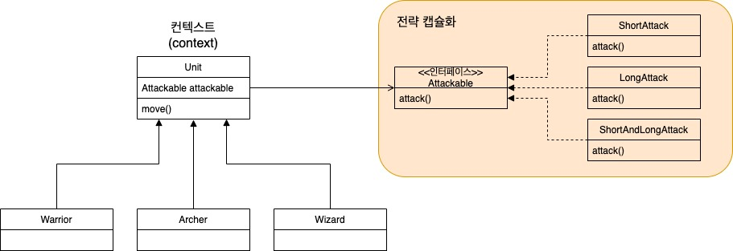

# [디자인 패턴] 전략 패턴 (Strategy Pattern)

## 1. 전략 패턴 정의


전략 패턴은 컨텍스트(context)에서 사용할 변경 가능한 **전략(알고리즘)**을 **인터페이스**를 이용하여 캡슐화하고, 필요에 따라 동적으로 변경하여 사용할 수 있도록 하는 디자인 패턴이다.
<br />
여기서 전략(알고리즘)이란 독립적인 책임으로 분리가 가능한 기능을 의미한다.

위키에서는 전략 패턴을 다음과 같이 정의하고 있다.


## 2. 전략 패턴을 사용하지 않는 경우 발생할 수 있는 문제점

전략 패턴을 사용하지 않고 구현한 간단한 예제를 보자. 
<br />
전쟁 게임에는 전사(warior), 궁수(archer)라는 공격 유닛이 있다. 각 유닉의 공격 방식은 다음과 같이 나뉜다.

- 전사 : 근거리 공격
- 궁수 : 원거리 공격

전사와 궁수를 추상화한 객체인 Unit은 다음과 같다.

```java
public abstract class Unit {
  public void move() {
    System.out.println("이동");
  }

  public abstract void role();
  public abstract void attack();
}
```

모든 유닛의 이동 방법이 동일하기 때문에 move() 메소드는 구현부는 가지고 있다. 반면 각각의 유닛은 역할과 공격 방법이 다르기 때문에 role(), attack() 메소드는 추상 메소드로 선언하였다.

이제 Unit을 상속하여 개별 유닛을 어떻게 구현할지 생각해보자. 

```java
// 전사
public class Warrior extends Unit {
  @Override
  public void role() {
    System.out.println("전사");
  }

  @Override
  public void attack() {
    System.out.println("근거리 공격");
  }
}

// 궁수
public class Archer extends Unit {
  @Override
  public void role() {
    System.out.println("궁수");
  }

  @Override
  public void attack() {
    System.out.println("원거리 공격");
  }
}
```

전사와 궁수는 Unit을 상속받아 role() 메소드와 attack() 메소드를 오버라이딩 하였다. 

전략 패턴을 사용하지 않은 예제에서는 두 가지 문제점이 존재한다.
<br />
**(1) 유닛의 공격 방식이 변경되는 경우 클래스를 직접 수정해야 한다.** => `개방 폐쇄 원칙 위반`

```java
public class Warrior extends Unit {
  @Override
  public void role() {
    System.out.println("전사");
  }

  @Override
  public void attack() {
    // 메소드 내부 수정 발생
    System.out.println("근거리 공격 & 원거리 공격");
  }
}
```

**(2) 전사, 궁수 이외의 유닛이 추가되는 경우 공격 방식이 동일한데도 불구하고 attack() 메소드를 중복해서 구현해야 한다.** => `코드 중복`

```java
public class Wizard extends Unit {
  @Override
  public void role() {
    System.out.println("마법사");
  }

  @Override
  public void attack() {
    // 메소드 중복 발생
    System.out.println("원거리 공격");
  }
}
```


## 3. 전략 패턴 사용 이유

앞선 예제에서 발생한 두 가지 문제를 해결하기 위해 전략 패턴을 사용한다.

**(1) 개방 폐쇄 원칙(OCP) 원칙 실현**
- attack() 메소드를 수정하지 않고도 특정 공격 방법으로 변경할 수 있어야 한다.

**(2) 코드 재사용**
- 동일한 공격 방법을 지닌 유닛은 코드를 재사용 할 수 있어야 한다.


## 4. 전략 패턴 적용하기

예제를 구현하기 전에 전략 패턴의 구조를 이해해야 한다. 
<br />
Attackable 인터페이스를 이용해 알고리즘(ShortAttack, LongAttack, ShortAndLongAttack)들을 캡슐화 하고, 컨텍스트(Warrior, Archer, Wizard를 포함한 Unit)에서 전략을 상황에 따라 동적으로 바꿔 사용할 수 있도록 하는 구조이다. 



### Unit

```java
public abstract class Unit {
  protected Attackable attackable;

  public abstract void role();

  public void move() {
    System.out.println("이동");
  }

  public void attack() {
    attackable.attack();
  }

  public void setAttackable(Attackable attackable) {
    this.attackable = attackable;
  }
}
```

### Attackable 인터페이스와 알고리즘들

```java
// 인터페이스
public interface Attackable {
  void attack();
}

// 근거리 공격 알고리즘
public class ShortAttack implements Attackable {
  @Override
  public void attack() {
    System.out.println("근거리 공격");
  }
}

// 원거리 공격 알고리즘
public class LongAttack implements Attackable {
  @Override
  public void attack() {
    System.out.println("원거리 공격");
  }
}
```

### Unit을 상속한 객체들

```java
// 전사
public class Warrior extends Unit {
  public Warrior(Attackable attackable) {
    super.attackable = attackable;
  }

  @Override
  public void role() {
    System.out.println("전사");    
  }
}

// 궁수
public class Archer extends Unit {
  public Archer(Attackable attackable) {
    super.attackable = attackable;
  }

  @Override
  public void role() {
    System.out.println("궁수");
  }
}
```

구현이 완료되었으니 클라이언트를 만들어 실제 컨텍스트의 동작을 확인해보자.

```java
public class StrategyPatternMain {
  public static void main(String[] args) {
    Unit warrior = new Warrior(new ShortAttack());
    warrior.role();
    warrior.move();
    warrior.attack();
    System.out.println();

    Unit Archer = new Archer(new LongAttack());
    archer.role();
    archer.move();
    archer.attack();
  }
}
```

출력 결과는 다음과 같다.

```
전사
이동
근거리 공격

궁수
이동
원거리 공격
```

Attackable 인터페이스를 Unit 슈퍼 클래스의 **구성**으로 사용하여, Unit을 상속 받은 서브 클래스에서 Attackable의 실제 구현체를 모르더라도 attack() 메소드를 사용할 수 있게 되었다. 유닛이 추가되면 구현되어 있는 공격 방법을 재사용 하면 되기 때문에 `코드 재사용`이 가능하다.

코드의 수정을 유발하기 위해 '전략 패턴을 적용하지 않은 경우'와 같이 '마법사' 유닛과 '근거리 & 원거리' 공격 방법을 추가하자.

```java
// 근거리 & 원거리 공격 알고리즘
public class ShortAndLongAttack implements Attackable {
  @Override
  public void attack() {
    System.out.println("근거리 & 원거리 공격");
  }
}
```

```java
// 마법사
public class Wizard extends Unit {
  public Wizard(Attackable attackable) {
    super.attackable = attackable;
  }

  @Override
  public void role() {
    System.out.println("마법사");
  }
}
```

'전략 패턴을 적용하지 않은 경우'와 달리 기존 클래스에 어떠한 변경도 발생하지 않았다. Attackable 인터페이스를 구현한 새로운 공격 방법을 추가하고, 마법사는 Unit 슈퍼 클래스를 상속 받기만 하면 된다.

만약 기존에 있던 전사의 공격 방법이 '근거리 & 원거리' 공격으로 변경된다고 해도 개별 클래스는 변경이 발생하지 않는다. Attackable 인터페이스를 이용해 구현체에 의존하지 않는 코드로 만들어놨기 때문이다.

```java
public class StrategyPatternMain {
  public static void main(String[] args) {
    Unit warrior = new Warrior(new ShortAttackable());
    warrior.role();
    warrior.move();
    warrior.attack();
    System.out.println();

    // 런타임에 전략을 바꿔보자
    warrior.setAttackable(new ShortAndLongAttackable());
    warrior.role();
    warrior.move();
    warrior.attack();
  }
}
```

```
전사
이동
근거리 공격

전사
이동
근거리 & 원거리 공격
```

런타임에 전략을 바꿔도 기존의 코드에는 어떠한 변경도 발생하지 않는다. 변경에는 닫혀있고 확장에는 열려 있는 코드를 구현함으로써 `개방 폐쇄 원칙(OCP)`을 실현하였다.


## 💡 정리하기

전략 패턴(Strategy Pattern)은 컨텍스트(context)가 사용할 변경 가능한 전략을 인터페이스를 이용해 캡슐화 하고, 필요에 따라 동적으로 전략을 변경할 수 있도록 하는 디자인 패턴이다.

전략 패턴을 사용하는 이유는 크게 두 가지가 있다.

**(1) 개방 폐쇄 원칙(OCP) 원칙 실현**
- 의존 클래스를 수정하지 않고도(변경 X) 기능을 추가하거나 변경할 수 있어야(확장 O) 한다.

**(2) 코드 재사용**
- 동일한 전략을 지닌 컨텍스트에서 하나의 전략을 재사용 할 수 있어야 한다.

전략 패턴은 디자인 패턴의 꽃이라고도 불릴 만큼 다양하게 자주 사용되기 때문에 확실하게 이해하고 넘어가자.